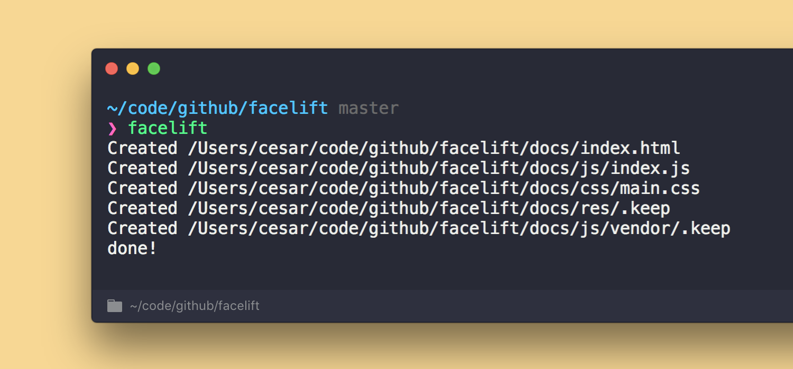

# awsnap
> Generate beautiful screenshots

<p align="center">
  
</p>

<p align="center">
  <a href="https://travis-ci.org/cesarferreira/awsnap"></a>
  <a href="https://www.npmjs.com/package/awsnap"></a>
  <a href="https://www.npmjs.com/package/awsnap"></a>
  <a href="https://github.com/cesarferreira/awsnap/blob/master/LICENSE"></a>
</p>

## Install

```sh
brew install pkg-config cairo libpng jpeg giflib imagemagick
```

```sh
npm install -g awsnap
```

## Usage

```
Usage

   $ awsnap <command> <params>

```

```
Examples
   $ awsnap generate 2000 800 f7d794 tmp/ss.png tmp/output.png 1500 700    
```

this will generate an image with the size of `2000 x 800`, color `#f7d794`, screenshot at `tmp/ss.png` will output into `tmp/output.png` and optionally will crop the image to be `1500 x 700`

## Created by
[Cesar Ferreira](https://cesarferreira.com)

## License
MIT © [Cesar Ferreira](http://cesarferreira.com)
